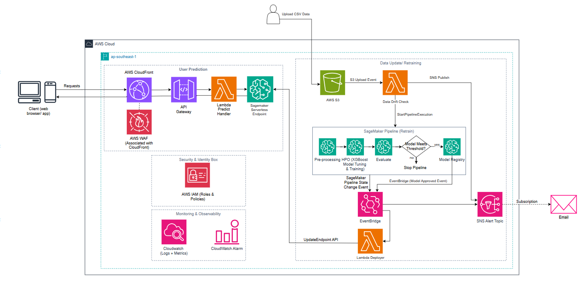

# Workshop Overview: MLOps Platform for Telco Customer Churn Prediction

## Problem Introduction
In the telecommunications industry (Telco), the cost of acquiring a new customer is typically 5 to 25 times higher than the cost of retaining an existing one. Early prediction of customer churn risk allows customer support teams to proactively offer timely promotion and support policies.

However, real-world Machine Learning models often face **Data Drift / Model Drift** — prediction quality degrades over time as user habits change. Furthermore, manual training and deployment of models from Jupyter Notebooks to Production is time-consuming and prone to operational errors.

This Workshop will build an **End-to-End Automated MLOps Platform** on **AWS Cloud**, thoroughly solving these challenges.

---

## Workshop Objectives
After completing this lab, you will master and deploy:
1. **Real-time Inference:** Integrate Amazon API Gateway, AWS Lambda, and AWS SageMaker Serverless Endpoint to process requests and return immediate churn probabilities at an optimal cost ($0 when there is no traffic).
2. **Event-Driven Trigger:** Automatically detect when an Admin uploads new data to Amazon S3, check for Data Drift, and launch the Retrain workflow.
3. **MLOps Workflow (SageMaker Pipeline - 4 steps):**
   - TelcoChurnProcessStep: Preprocess data and split into Train/Validation/Test sets (SKLearnProcessor).
   - TelcoChurnHpoStep: Train & Hyperparameter Optimize automatically with XGBoost model (HyperparameterTuner).
   - TelcoChurnEvalStep: Evaluate model quality on Test set (ScriptProcessor).
   - ConditionStep: Check quality threshold ($AUC \ge 0.80$). If qualifying, automatically register into SageMaker Model Registry with Approved status.
4. **Continuous Deployment (CD):** Use Amazon EventBridge to listen for Approved state changes from Model Registry to trigger AWS Lambda Deployer automatically updating the Serverless Endpoint with Zero-Downtime Deployment.
5. **Monitoring & Alerting:** Centralized log storage via CloudWatch Logs, set up CloudWatch Alarm, and send automated email alerts to mailbox via Amazon SNS.

---

## System Architecture Diagram

### AWS Services Used:
- **Amazon S3:** Stores raw data, processed data, and Model Artifacts.
- **Amazon API Gateway & AWS Lambda:** Provides REST API endpoints and processes real-time request data preprocessing.
- **AWS SageMaker Serverless Endpoint:** Deploys XGBoost model in Serverless mode, auto-scaling.
- **AWS SageMaker Pipelines:** Manages and orchestrates automated 4-step ML workflow.
- **AWS SageMaker Model Registry:** Stores and manages centralized model versions.
- **Amazon EventBridge:** Listens for state transition events from Pipeline and Model Registry.
- **Amazon SNS:** Sends Email notifications for Retrain results and automated incident alerts.
- **Amazon CloudWatch:** Stores system logs, monitors metrics, and triggers error alarms.

---

## Estimated Time & Cost
- **Execution Time:** ~60 - 90 minutes.
- **Infrastructure Cost:** ~$0.50 - $1.00 USD (If resources are cleaned up following the Clean-up step at the end of the lab, most services fall within AWS Free Tier).