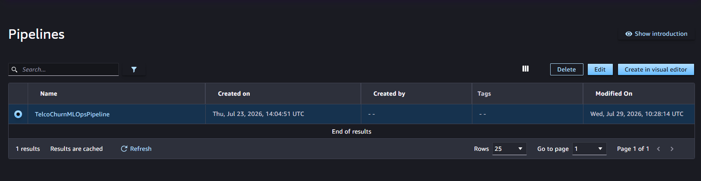

To avoid incurring unnecessary charges on your AWS account after completing workshop testing, perform resource clean-up following the sequence of steps below.

#### Delete SageMaker Serverless Endpoint & Configurations
- Access Amazon SageMaker Studio $\rightarrow$ Deployments $\rightarrow$ Endpoints: Select telco-churn-serverless-endpoint $\rightarrow$ Delete.

- Select JumpStart / Models: Select TelcoChurnModelGroup $\rightarrow$ Delete.

#### Delete SageMaker Pipeline
- In SageMaker Console, open Pipelines section.
- Select TelcoChurnPipeline (or your Pipeline name).
- Click Delete and confirm Pipeline deletion.
