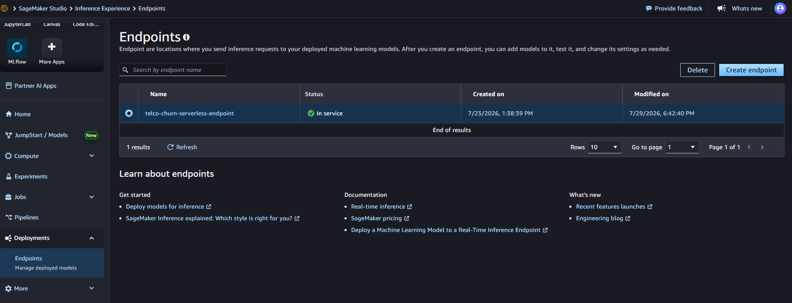
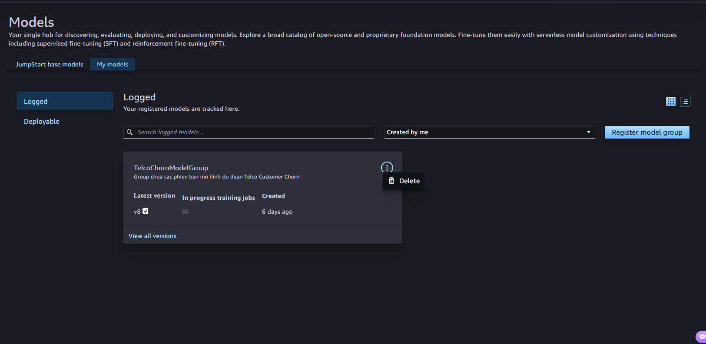

Để tránh phát sinh chi phí không cần thiết trên tài khoản AWS sau khi hoàn tất kiểm thử bài workshop, hãy thực hiện dọn dẹp toàn bộ tài nguyên theo trình tự các bước dưới đây.

#### Xóa SageMaker Serverless Endpoint & Configurations
- Truy cập Amazon SageMaker Studio $\rightarrow$ Deployments $\rightarrow$ Endpoints: Chọn telco-churn-serverless-endpoint $\rightarrow$ Delete.

- Chọn JumpStart / Models: Chọn TelcoChurnModelGroup $\rightarrow$ Delete.

#### Xóa SageMaker Pipeline
- Trong SageMaker Console, mở mục Pipelines.
- Chọn TelcoChurnPipeline (hoặc tên Pipeline của bạn).
- Bấm Delete và xác nhận xóa Pipeline.

